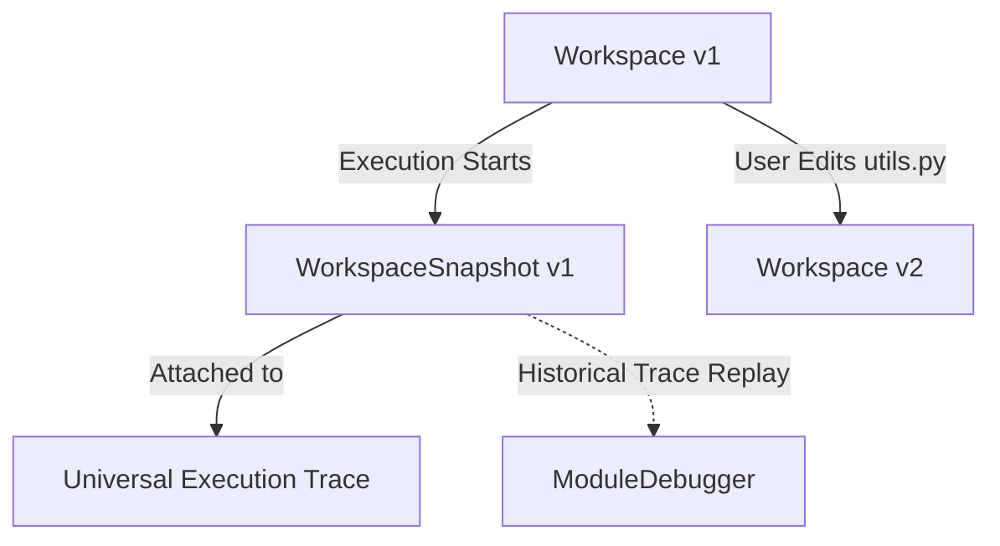

# ProViz Stage 10: Universal Multi-File & Module Debugging Architecture

## Overview

ProViz Stage 10 introduces the **Universal Multi-File & Module Debugging Architecture**. In previous stages, ProViz operated on a single executable source unit (`main.py`). In real-world software development, programs span multiple files, modules, packages, and directories (e.g., `main.py`, `utils.py`, `models.py`, `services/auth.py`).

Stage 10 elevates ProViz into a language-neutral multi-file visual IDE and time-travel debugger without binding the core architecture to Python-specific import semantics or sacrificing historical trace determinism.

---

## Architectural Pipeline

```
                    PROGRAM WORKSPACE
                           │
             ┌─────────────┼─────────────┐
             ↓             ↓             ↓
          main.py       utils.py      models.py
             │             │             │
             └─────────────┼─────────────┘
                           ↓
                      MODULE GRAPH
                           ↓
                   LANGUAGE EXECUTOR
                           ↓
               UNIVERSAL EXECUTION TRACE
                           ↓
                    GLOBAL TIMELINE
                           ↓
                     RUNTIME STATE
                           ↓
                      SCENE GRAPH
                           ↓
                     LAYOUT ENGINE
                           ↓
                   TRANSITION ENGINE
                           ↓
                   ANIMATION RUNTIME
                           ↓
                     SCENE RENDERER
```

---

## Core Components & Data Structures

### 1. SourceFile (`src/workspace/SourceFile.js`)
Renderer-independent representation of a source file within a workspace. File identity is permanent and stable (not tied to transient editor tab index or buffer position).

```typescript
interface SourceFile {
    id: string;          // Stable identifier (e.g. 'file_main', 'file_utils')
    path: string;        // Relative path in workspace (e.g. 'src/utils.py')
    name: string;        // Base filename (e.g. 'utils.py')
    language: string;    // Language identifier (e.g. 'python', 'javascript')
    content: string;     // UTF-8 source text
    moduleId: string;    // Associated module identifier (e.g. 'module_utils')
    version: number;     // File content revision counter
    metadata: object;    // User/language metadata
}
```

### 2. SourceLocation (`src/workspace/SourceLocation.js`)
Universal language-neutral source coordinate. Replaces raw single-integer line numbers with file- and module-aware coordinates.

```typescript
interface SourceLocation {
    fileId: string | null;     // Stable file ID
    moduleId: string | null;   // Containing module ID
    path: string | null;       // File path or filename
    file: string;              // Backward-compatible path alias
    line: number | null;       // 1-indexed source line number
    column: number | null;     // Column offset
    endLine: number | null;    // Range end line (optional)
    endColumn: number | null;  // Range end column (optional)
}
```

### 3. Module (`src/workspace/Module.js`)
Language-neutral module abstraction capable of representing Python modules/packages, JavaScript/TypeScript ES modules, Java packages, C/C++ translation units, and Rust crates.

```typescript
interface Module {
    id: string;            // Unique module ID (e.g. 'module_models')
    name: string;          // Display name (e.g. 'models')
    path: string;          // Logical or directory path
    language: string;      // Language identifier
    fileIds: string[];     // Set of SourceFile IDs owned by this module
    imports: string[];     // Module IDs or specifiers imported by this module
    exports: string[];     // Exported symbols / submodules
    metadata: object;
}
```

### 4. ModuleGraph (`src/workspace/ModuleGraph.js`)
Directed dependency graph tracking imports and dependents across modules.

Key capabilities:
- **Cycle Safety:** Employs cycle-safe BFS/DFS graph traversals to ensure mutual/circular imports (`A -> B -> C -> A`) never cause infinite recursion.
- **Shortest Import Path:** `getImportPath(from, to)` computes the exact import chain via breadth-first search.
- **Connected Components:** `getConnectedModules(moduleId)` computes transitive dependency reachability.
- **Topological Sorting:** `getTopologicalOrder()` returns module execution order with graceful cycle handling.

### 5. Workspace & WorkspaceSnapshot (`src/workspace/Workspace.js`, `WorkspaceSnapshot.js`)
- `Workspace` manages mutable source files and module definitions, incrementing its `version` counter on any source changes.
- `WorkspaceSnapshot` is an **immutable, frozen snapshot** captured at the moment execution starts.



---

## Historical Trace Integrity Invariant

When a user edits a source file (e.g. editing `utils.py` line 14) while inspecting or replaying an earlier execution trace, the debugger **must never silently map old trace events onto the modified source text**.

ProViz guarantees historical trace integrity:
1. When execution begins, an immutable `WorkspaceSnapshot` is bound to the `ExecutionRequest` and `ExecutionTrace`.
2. Any subsequent editor mutations increment the `Workspace` version without altering previous snapshots.
3. The `SourceMap` resolves coordinates against the bound `WorkspaceSnapshot`.

---

## Multi-File Debugging & Execution Semantics

### 1. Cross-File Call Stacks
When execution transitions across files (e.g., `main.py` calling `utils.py:calculate()`, which in turn calls `models.py:double()`), each `CallFrame` preserves its declaring `fileId`, `moduleId`, and `sourceLocation`.

```
Call Stack:
 ├── [Frame 3] double()    -> models.py:2   (module: m_models)
 ├── [Frame 2] calc()      -> utils.py:3    (module: m_utils)
 └── [Frame 1] <module>    -> main.py:2     (module: m_main)
```

### 2. Multi-File Breakpoint Isolation
Breakpoints are explicitly file-aware. A breakpoint set on `utils.py:10` will **never** trigger at `main.py:10`.

```javascript
// File-aware breakpoint matching
debugger.addBreakpoint('utils.py', 10);
// During continue(), loc = { file: 'main.py', line: 10 } -> No match
// When loc = { file: 'utils.py', line: 10 } -> Breakpoint Hit!
```

### 3. Cross-Module Heap Identity Invariant
Shared heap objects passed across modules maintain a **single canonical heap object ID** (e.g. `obj_1`). ProViz strictly forbids embedding filenames into heap object IDs (e.g. `obj_utils_py_1`), ensuring that object aliasing, references, and mutation tracking remain 100% unified across all modules.

---

## SourceMap & Editor Integration

The `SourceMap` provides bidirectional O(1) indexing:
- **Trace Event / Timeline Frame $\leftrightarrow$ SourceLocation**
- **File / File + Line $\leftrightarrow$ Matching Trace Events / Frame Indices**

The `EditorDebuggerAdapter` receives notifications from the authoritative `Debugger` and:
1. Fires `onFileSwitch(file, fileId)` when the execution point moves to a different file.
2. Fires `highlightFn(line, file, fileId)` to highlight the active line in the appropriate editor tab.

---

## SceneGraph, ObjectInspector, Layout & Animation Integration

- **SceneGraph:** `CALL_FRAME` and `VARIABLE` scene nodes carry `fileId`, `moduleId`, `declaringFileId`, and `declaringModuleId` metadata.
- **ObjectInspector:** Operates on the unified `RuntimeState.heap`, allowing seamless inspection of heap structures regardless of which module declared or referenced them.
- **Global Timeline:** A single, unified, deterministic timeline contains all execution steps across all files in true chronological order.
- **Layout & Animation:** Spatial layout and animation interpolation smoothly transition across multi-file calls without duplicating shared objects.

---

## Browser-First Python Execution via Pyodide

ProViz remains **100% browser-first with zero backend server dependencies**.
Multi-file Python execution in Pyodide is achieved by:
1. Populating Pyodide's virtual in-memory file system (`pyodide.FS.writeFile`) with all workspace files before execution.
2. The Python tracer inspects `frame.f_code.co_filename` to record exact module filenames.
3. Standard Python `import` and `from ... import ...` statements execute natively in WASM.

---

## Performance Benchmarks

| Benchmark Metric | Measured Time | Threshold |
| :--- | :--- | :--- |
| Create 1,000 File Workspace | **3.2 ms** | $< 200\text{ ms}$ |
| Snapshot 1,000 File Workspace | **3.0 ms** | $< 100\text{ ms}$ |
| Build SourceMap for 10,000 Events | **33.8 ms** | $< 250\text{ ms}$ |
| Frame Location O(1) Index Lookup | **0.004 ms** | $< 5\text{ ms}$ |

---

## Architectural Invariants Maintained

1. **RuntimeState Authority:** RuntimeState remains the single source of runtime truth.
2. **Global Timeline:** One global timeline represents the entire program execution.
3. **Deterministic Snapshots:** Historical traces remain bound to their original workspace snapshots.
4. **Clean Object Identity:** Heap object IDs are independent of source file paths.
5. **Language Independence:** Workspace, Module, ModuleGraph, and SourceLocation abstractions contain zero language-specific keywords.
6. **Backward Compatibility:** All single-file UET traces from Stages 1–9 execute identically.
